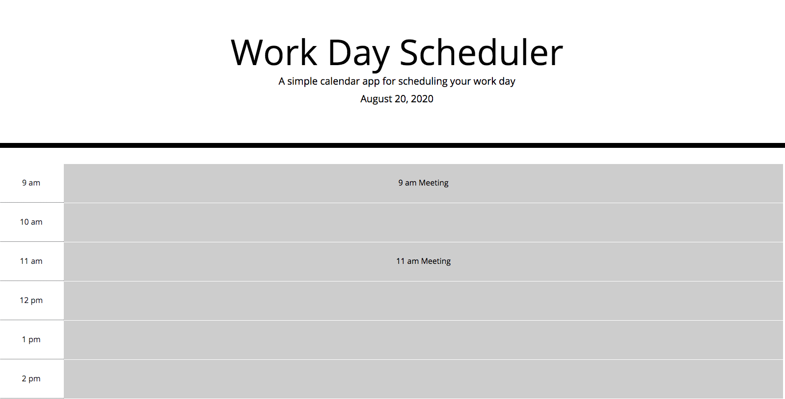

# daily-planner

This website generates allows the user to input events at each hour time block from 9 am to 5 pm.

The events are stored in local storage, so when the page is refreshed the events will remain on the page.

All past hour blocks are grey, the current hour block is red, and future hour blocks are green.
